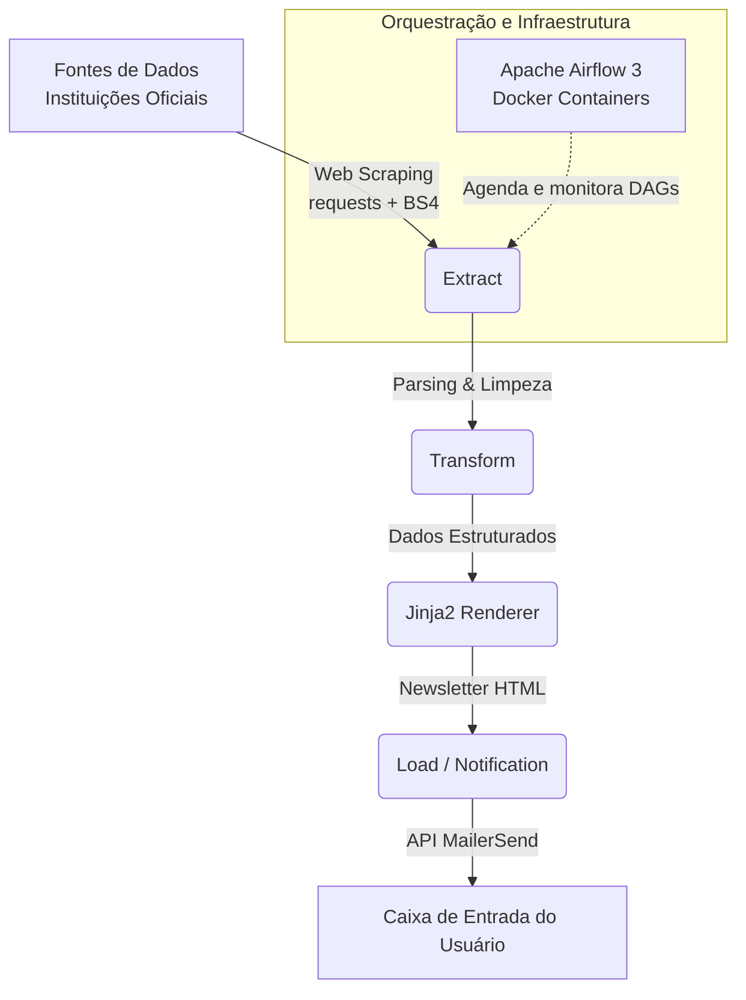

# 📡 Economic Reports Automation

## 🎯 O Problema e o Propósito
Profissionais do mercado financeiro, pesquisadores e estudantes de economia precisam estar sempre atualizados com a publicação de relatórios econômicos oficiais (como a Carta de Conjuntura do IPEA, Revista Conjuntura Econômica da FGV, Boletim Macro, etc). Fazer essa verificação manualmente entrando site por site diariamente é ineficiente e propenso a falhas, atrasando o acesso à informação em primeira mão.

Este projeto de Engenharia de Dados propõe solucionar esse problema através de um pipeline automatizado que monitora os principais portais de publicações econômicas, extrai novas publicações assim que são lançadas e consolida essas informações em uma newsletter formatada em HTML, enviada diretamente para o e-mail do usuário.

## 🏗️ Sobre o Projeto e Arquitetura do ETL
O projeto implementa um pipeline clássico de extração, transformação e carregamento (ETL), focado na captura de dados não-estruturados (HTML) e orquestrado para funcionar de maneira programada e autônoma.

O fluxo de dados consiste em:
1. **Extract**: Acessar os portais via web scraping simulando clientes legítimos, criando sessões HTTP robustas (com retry e negociação moderna de TLS).
2. **Transform**: Processar a árvore da página (parseamento via BeautifulSoup) mapeando elementos de interesse (títulos, links dos PDFs e sumários de publicações) e estruturar os dados com classes em Python.
3. **Load**: Carregar e injetar os dados extraídos em templates de UI (via Jinja2), montando a newsletter em formato HTML, que por fim aciona uma API via HTTP para o disparo do alerta em tempo real.

**Diagrama de Arquitetura:**



## 🧩 Pipelines Disponíveis

A arquitetura do projeto foi desenhada com componentes modulares (ex: `BaseExtractor`). Isso permite um ciclo rápido de desenvolvimento de novos crawlers para integrar o ecossistema. 

| DAG | Fonte da Publicação | Frequência | Status |
|-----|-------|-----------|--------|
| `fgv_newsletter_pipeline` | [Revista Conjuntura Econômica — FGV](https://portalibre.fgv.br/revista-conjuntura-economica) | Semanal (`@weekly`) | ✅ Ativo |

O pipeline já considera atualizações do repositório para adicionar relatórios do IPEA e Banco Central em breve.

## 🛠️ Stack de Tecnologias

Para construir um ambiente escalável, versionável e tolerante à falha, foram escaladas as seguintes tecnologias:

- **Linguagem Principal**: Python 3.12+
- **Orquestração**: Apache Airflow 3
- **Infraestrutura e Containerização**: Docker & Docker Compose (PostgreSQL 16 base do Airflow)
- **Extração de Dados**: `requests`, `urllib3` (HttpAdapter/Retry), `BeautifulSoup4`
- **Renderização de Lógica de Layout**: Jinja2
- **Gerenciador de Dependências**: Poetry (exportado para requirements em produção)
- **Serviço de E-mail**: MailerSend API
- **Gerenciamento de Configuração**: `pydantic-settings` (.env management)

## ⚙️ Como Configurar e Executar

### Pré-requisitos
- Docker e Docker Compose instalados no ambiente de Host.
- Conta válida no [MailerSend](https://www.mailersend.com/) (com uma API Key gerada).

### 1. Clone o repositório
```bash
git clone https://github.com/rafaelladuarte/economic-reports-automation.git
cd economic-reports-automation
```

### 2. Configure as variáveis de ambiente base
Crie ou copie o arquivo `.env` para a raiz do repositório. Ele será usado pydantic e também pelo Docker. Exemplo de conteúdo do `.env`:

```env
# MailerSend (Serviço de disparo)
MAILERSEND_API_KEY=mlsn.xxxxxxxxxxxxxxxxxxxx
MAILERSEND_DOMAIN=seu-dominio.mlsender.net
MAILERSEND_RECIPIENT=seu@email.com

# Contexto de permissão Docker & Airflow
AIRFLOW_UID=50000
```

### 3. Deploy dos Componentes via Docker
Faça o build da imagem custom do Airflow que vai embutir as dependências do projeto listadas nos requirimentos:

```bash
docker compose up -d --build
```
> *Nota: Na primeira emersão do ambiente, o contêiner `airflow-init` rodará todas as migrações do PostgreSQL e criará as credenciais de admin (`airflow` / `airflow`). Vá para `localhost:8080` para acompanhar as execuções.*

### 4. Execuções Locais (Testes e Dev sem Airflow)
Caso precise rodar a engine sem subir o orquestrador (facilitar os testes dos Extratores ou edição do template HTML da newsletter):
```bash
poetry install
poetry run python test_fgv.py
```

## 📄 Licença
Este projeto possui os termos da licença [MIT](LICENSE).
